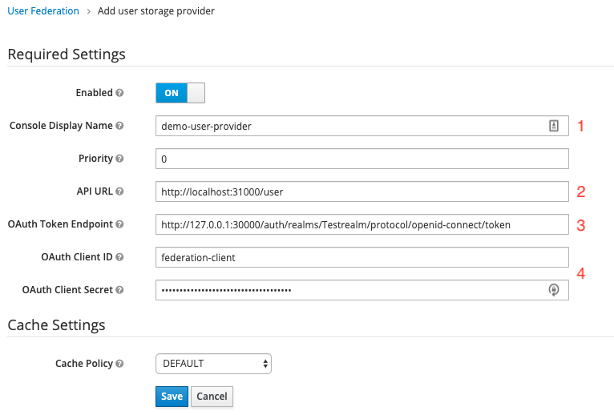

# Keycloak User Storage SPI demo
This is a demonstration on how to connect keycloak to a out-of-the-box unsupported user storage type/format. (For demonstration purposes an external MySQL database)

The solution demonstrated in this branch uses manually constructed JPA connection. The reason behind this architectural decision is the way connections are usually established when using the Java Persistence API. Usually there's a `persistence.xml`-file deployed on the application server bundled with the application. 

This has one major drawback - Connections are hardcoded and providers to different databases require multiple deployments.

To utilize the on-the-fly runtime configuration of providers in Keycloak, we need a way to construct JPA connections **at runtime**.

## Setup

### Requirements
* Current version of Java installed (preferable JDK11 or 13 from https://adoptopenjdk.net/)
* Current version of Docker installed (for the MySQL server)
* A Java IDE (like [Eclipse](https://www.eclipse.org/downloads/), [SpringToolSuite](https://spring.io/tools), [IntelliJ](https://www.jetbrains.com/idea/download), [Visual Studio Code](https://code.visualstudio.com/))
* [Postman](https://www.getpostman.com/downloads/) to test requests to the REST Api
* A keycloak instance

### Getting Started

#### Steps to deploy the user storage provider
1. Execute `./gradlew jar` and wait till it's finished processing
2. Copy the `keycloak-user-store-1.0.0-SNAPSHOT.jar` from your `./build/libs/`-folder to `<pathToKeycloak>/standalone/deployments/`
3. WildFly (= application server of keycloak) should now automatically deploy the JAR-file and make it available in Keycloak (Providing that keycloak is running)

#### Configure the user storage provider for your realm in keycloak

1. The name you want to be displayed by the user when it's a federated user. (and in the logs if something fails)
2. A name for the connection. All connections are held in a map once under a specific key specified in this field. By this connections are established faster and can be reused for multiple providers that federate the same datasource
3. Hostname of the database server (e.g. localhost or 127.0.0.1)
4. Name of the database on the database server (**Attention:** create the database before, it won't be created by Hibernate. Only the schema is generated.)
5. Username and password to the database server (and the specified database)
6. Here you can specify the port of your MySQL database server. If it's the default port, leave it at `3306`.

## Problems you might come across
#### Not finding any information on how to contruct JPA connections (with Hibernate) at runtime
We had the same problem and came to the conclusion that it wasn't meant to be used this way. By reverse engineering different frameworks that utilize JPA we found a workaround, which has one immense drawback. It uses the Hibernate built-in connection pool, which is not recommended for production use. Plus a lot of other drawbacks, like the need for manual transaction handling.

To start connections at runtime you need to create an object of `javax.persistence.spi.PersistenceUnitInfo`. Then you can generate a `EntityManagerFactory` to create connections from:
```java
MultivaluedHashMap<String, String> config = model.getConfig();
properties.put("hibernate.connection.driver_class", "com.mysql.cj.jdbc.Driver");
properties.put("hibernate.connection.url",
        String.format("jdbc:mysql://%s:%s/%s",
                config.getFirst(DB_HOST_KEY),
                config.getFirst(DB_PORT_KEY),
                config.getFirst(DB_DATABASE_KEY)));
properties.put("hibernate.connection.username", config.getFirst(DB_USERNAME_KEY));
properties.put("hibernate.connection.password", config.getFirst(DB_PASSWORD_KEY));
properties.put("hibernate.show-sql", "true");
properties.put("hibernate.archive.autodetection", "class, hbm");
properties.put("hibernate.hbm2ddl.auto", "update");
properties.put("hibernate.connection.autocommit", "true");
entityManagerFactory = new HibernatePersistenceProvider().createContainerEntityManagerFactory(getPersistenceUnitInfo("h2userstorage"), properties);
```

#### Compared to examples online, if I modify an entity it's not persisted back into the database
This problem occurs due to manually constructing the JPA connection. You need to manually start a transaction and persist entities once you modified them.

## Reference Documentation

For further reference, please consider the following sections:

* [Official Keycloak SPI documentation](https://www.keycloak.org/docs/latest/server_development/index.html#_user-storage-spi)